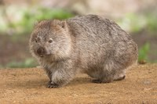

# Project Wombat

Welcome to Project Wombat

Wombats are short-legged, muscular quadrupedal marsupials that are native to Australia.

  Watch [Wombat Wikipedia Scroll](https://replayable.io/replay/6319789916af6c0067bfcdaa/?share=j7BrlJq0UJ0J2eBrLKRjQ) on Replayable
